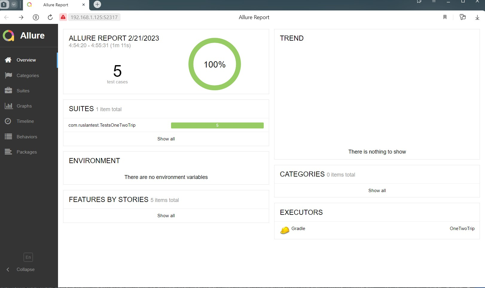

## Автотесты для сайта https://www.onetwotrip.com

### Содержание:

- <a href="#технологии-и-инструменты">Технологии и инструменты</a>
- <a href="#реализованные-проверки">Реализованные проверки</a>
- <a href="#запуск-из-терминала">Запуск из терминала</a>
- <a href="#allure-отчет">Allure отчет</a>

### [Технологии и инструменты](#технологии-и-инструменты)

### [Реализованные проверки](#реализованные-проверки)
* Проверка формы регистрации на наличие всех элементов
* Проверка восстановления пароля
* Проверка авторизации
* Проверка формы регистрации на наличие всех элементов
* Проверка переходов на vk, ok, mail, twitter для авторизции

### [Запуск из терминала](#запуск-из-терминала)
* #### Локальный запуск тест-кейсов
**gradle clean test**

* #### Удаленный запуск тест-кейсов
**clean test**  
-Dbrowser=${PROPERTYBROWSER}  
-DbrowserVersion=${PROPERTYVERSION}  , где  
**browser** - браузер, по умолчанию Chrome;  
**browserVersion** - версия браузера, по умолчанию 110;  
Необходимо добавить файл src/test/resources/config/credentials.properties с полями
user
password
email
passwordOneTwoTrip
videoStorage
remote

### [Allure отчет](#allure-отчет)
#### Сводные данные

#### Тест-кейсы

* ##### **Пример успешного прохождения тест-кейса**

